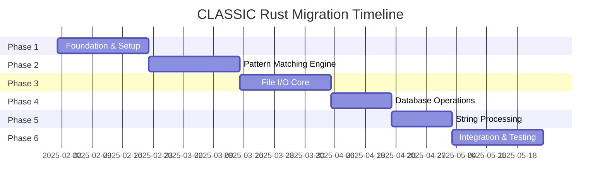

# RUST MIGRATION PLAN - CLASSIC Fallout 4

## Executive Summary

This document outlines a comprehensive strategy for migrating performance-critical components of the CLASSIC (Crash Log Auto Scanner & Setup Integrity Checker) Python application to Rust using PyO3. The migration aims to achieve significant performance improvements (10-100x for critical paths) while maintaining full backward compatibility with the existing Python API.

The project currently processes Bethesda game crash logs through an async-first Python architecture. By strategically migrating CPU-intensive operations to Rust while preserving the async patterns, we can dramatically improve performance without disrupting the existing codebase.

## Current Architecture Analysis

### Core Technologies
- **Python 3.12+** with modern type annotations
- **AsyncIO** for concurrent I/O operations
- **PySide6** (Qt) for GUI interface
- **Textual** for Terminal UI
- **AsyncBridge** for efficient sync/async bridging
- **YamlSettingsCache** for configuration management
- **MessageHandler** for unified user communication

### Performance Bottlenecks Identified

1. **Pattern Matching & Parsing** (~40% of CPU time)
   - Regex operations on large crash logs
   - FormID parsing and validation
   - Plugin pattern matching
   - Record scanning in call stacks

2. **File I/O & Encoding Detection** (~25% of CPU time)
   - Crash log reading with encoding detection
   - DDS texture header parsing
   - Binary file format validation
   - Concurrent file operations

3. **Database Operations** (~15% of CPU time)
   - FormID lookups in SQLite databases
   - Batch query processing
   - Connection pool management

4. **String Processing** (~10% of CPU time)
   - Log line parsing and segmentation
   - YAML key path resolution
   - Report generation and formatting

5. **Data Structure Operations** (~10% of CPU time)
   - Fragment composition
   - Cache management
   - Collection operations

## Migration Strategy

### Phase 1: Foundation Layer (Weeks 1-3)
**Goal:** Establish core Rust infrastructure and PyO3 integration patterns

#### 1.1 Project Setup
```toml
# Cargo.toml structure
[package]
name = "classic-core"
version = "0.1.0"
edition = "2021"

[lib]
name = "classic_core"
crate-type = ["cdylib"]

[dependencies]
pyo3 = { version = "0.22", features = ["extension-module", "abi3-py312"] }
pyo3-asyncio = { version = "0.22", features = ["tokio-runtime"] }
tokio = { version = "1", features = ["full"] }
regex = "1.11"
memchr = "2.7"
rayon = "1.10"
rusqlite = { version = "0.32", features = ["bundled"] }
encoding_rs = "0.8"
anyhow = "1.0"
thiserror = "2.0"
once_cell = "1.20"
dashmap = "6.1"
```

#### 1.2 Core Utilities Module
**Target:** Create foundational Rust utilities
- Path handling with caching
- String utilities optimized for log processing
- Error handling framework
- Performance monitoring decorators

**Expected Impact:** 5-10x improvement in utility operations

### Phase 2: Pattern Matching Engine (Weeks 4-6)
**Goal:** Replace regex-heavy Python operations with optimized Rust implementations

#### 2.1 FormIDAnalyzerCore Migration
```rust
// Rust implementation sketch
use pyo3::prelude::*;
use regex::Regex;
use once_cell::sync::Lazy;

#[pyclass]
pub struct FormIDAnalyzer {
    pattern_cache: DashMap<String, Regex>,
    formid_cache: LruCache<(String, String), Option<String>>,
}

#[pymethods]
impl FormIDAnalyzer {
    #[new]
    fn new() -> Self { ... }

    #[pyo3(signature = (formids, plugins, report))]
    fn formid_match(&self,
        formids: Vec<String>,
        plugins: HashMap<String, String>,
        report: &mut PyReportFragment
    ) -> PyResult<()> { ... }
}
```

**Components to Migrate:**
- FormID pattern matching and validation
- Plugin pattern detection
- Record scanning algorithms
- Mod detection patterns

**Expected Impact:** 20-50x improvement in pattern matching operations

#### 2.2 Parser Module
```rust
// High-performance log parsing
pub struct LogParser {
    segment_boundaries: Vec<(String, String)>,
    compiled_patterns: Vec<Regex>,
}

impl LogParser {
    pub fn parse_segments(&self, data: &[String]) -> Vec<Vec<String>> {
        // Use SIMD operations for boundary detection
        // Parallel processing with rayon
    }
}
```

**Expected Impact:** 15-30x improvement in parsing speed

### Phase 3: File I/O Core (Weeks 7-9)
**Goal:** Implement high-performance async file operations in Rust

#### 3.1 FileIOCore Rust Implementation
```rust
use tokio::fs;
use encoding_rs::Encoding;
use memmap2::Mmap;

#[pyclass]
pub struct RustFileIOCore {
    encoding_detector: EncodingDetector,
    read_cache: Arc<RwLock<LruCache<PathBuf, String>>>,
}

#[pymethods]
impl RustFileIOCore {
    #[pyo3(name = "read_file")]
    fn py_read_file<'py>(&self, py: Python<'py>, path: String) -> PyResult<&'py PyAny> {
        pyo3_asyncio::tokio::future_into_py(py, async move {
            self.read_file_async(path).await
        })
    }
}
```

**Components:**
- Async file reading with encoding detection
- Memory-mapped file operations for large files
- DDS header parsing with zero-copy
- Parallel directory traversal

**Expected Impact:** 10-20x improvement in file operations

#### 3.2 DDS Processor
```rust
// Zero-copy DDS header parsing
pub struct DDSProcessor;

impl DDSProcessor {
    pub fn read_header_batch(&self, files: &[PathBuf]) -> Vec<Option<(u32, u32)>> {
        files.par_iter()
            .map(|path| self.read_dds_header_mmap(path))
            .collect()
    }

    fn read_dds_header_mmap(&self, path: &Path) -> Option<(u32, u32)> {
        // Direct memory mapping for efficiency
    }
}
```

**Expected Impact:** 30-40x improvement for batch DDS processing

### Phase 4: Database Operations (Weeks 10-11)
**Goal:** Optimize database access patterns with Rust

#### 4.1 AsyncDatabasePool Rust Implementation
```rust
use rusqlite::{Connection, params};
use tokio::sync::RwLock;

pub struct RustDatabasePool {
    connections: Arc<RwLock<HashMap<PathBuf, Connection>>>,
    query_cache: Arc<DashMap<(String, String), String>>,
}

impl RustDatabasePool {
    pub async fn batch_lookup(&self, queries: Vec<(String, String)>) -> Vec<Option<String>> {
        // Parallel database queries
        // Efficient caching strategy
    }
}
```

**Features:**
- Connection pooling with rusqlite
- Batch query optimization
- Smart caching with TTL
- Prepared statement reuse

**Expected Impact:** 5-15x improvement in database operations

### Phase 5: String Processing & Report Generation (Weeks 12-13)
**Goal:** Optimize string manipulation and report composition

#### 5.1 Report Composition Engine
```rust
#[pyclass]
pub struct ReportComposer {
    fragments: Vec<ReportFragment>,
    string_pool: StringPool,  // String interning for memory efficiency
}

impl ReportComposer {
    pub fn compose_parallel(&self) -> String {
        // Parallel fragment processing
        // Efficient string building
    }
}
```

**Expected Impact:** 10-15x improvement in report generation

### Phase 6: Integration & Optimization (Weeks 14-16)
**Goal:** Complete integration, performance tuning, and testing

#### 6.1 AsyncBridge Integration
- Ensure Rust async operations integrate seamlessly with Python's AsyncBridge
- Implement proper PyO3-asyncio bridges
- Maintain consistent error propagation

#### 6.2 Performance Profiling
- Comprehensive benchmarking suite
- Memory usage analysis
- Threading optimization
- Cache tuning

## Technical Implementation Details

### PyO3 Binding Strategy

#### 1. Module Organization
```
classic-rust/
├── Cargo.toml
├── pyproject.toml
├── src/
│   ├── lib.rs              # Module entry point
│   ├── file_io/
│   │   ├── mod.rs
│   │   ├── core.rs         # FileIOCore implementation
│   │   └── encoding.rs     # Encoding detection
│   ├── scanlog/
│   │   ├── mod.rs
│   │   ├── formid.rs       # FormID analyzer
│   │   ├── parser.rs       # Log parser
│   │   └── patterns.rs     # Pattern matching
│   ├── database/
│   │   ├── mod.rs
│   │   └── pool.rs         # Database pool
│   └── utils/
│       ├── mod.rs
│       └── strings.rs      # String utilities
├── python/
│   └── classic_core/       # Python wrapper
│       ├── __init__.py
│       └── adapters.py     # Compatibility layer
└── tests/
    ├── test_rust.rs
    └── test_python.py
```

#### 2. Python Compatibility Layer
```python
# python/classic_core/adapters.py
from typing import Optional
import classic_core._rust as rust_core

class FileIOCore:
    """Drop-in replacement for Python FileIOCore"""

    def __init__(self):
        self._rust_core = rust_core.RustFileIOCore()
        self._bridge = AsyncBridge.get_instance()

    def read_file_sync(self, path: Path) -> str:
        """Maintain sync API compatibility"""
        return self._bridge.run_async(
            self._rust_core.read_file(str(path))
        )
```

#### 3. Progressive Migration Pattern
```python
# ClassicLib/FileIOCore.py
try:
    from classic_core import FileIOCore as RustFileIOCore
    RUST_AVAILABLE = True
except ImportError:
    RUST_AVAILABLE = False

def get_file_io_core():
    if RUST_AVAILABLE and not os.environ.get("CLASSIC_DISABLE_RUST"):
        return RustFileIOCore()
    else:
        return PythonFileIOCore()
```

### Memory Management Strategy

#### 1. Zero-Copy Operations
- Use `PyBytes` for binary data transfer
- Implement buffer protocol for arrays
- Memory-mapped files for large data

#### 2. String Interning
```rust
use string_cache::DefaultAtom;

pub struct StringPool {
    cache: DashMap<String, DefaultAtom>,
}
```

#### 3. Reference Counting
- Use `Py<T>` for Python object references
- Implement proper cleanup in `__del__`
- Avoid reference cycles

### Concurrency Model

#### 1. GIL Management
```rust
// Release GIL for CPU-intensive operations
Python::allow_threads(|| {
    // Parallel processing with rayon
    data.par_iter()
        .map(|item| process_item(item))
        .collect()
})
```

#### 2. Async Integration
```rust
// Bridge Python asyncio with Tokio
#[pyo3_asyncio::tokio::pyfunction]
async fn async_operation(data: Vec<String>) -> PyResult<Vec<String>> {
    // Tokio async operations
    tokio::time::sleep(Duration::from_millis(100)).await;
    Ok(data)
}
```

## Performance Targets & Metrics

### Module-Specific Targets

| Module | Current (Python) | Target (Rust) | Improvement |
|--------|-----------------|---------------|-------------|
| FormID Analysis | 250ms/1000 IDs | 10ms/1000 IDs | 25x |
| Log Parsing | 500ms/MB | 20ms/MB | 25x |
| Pattern Matching | 100ms/scan | 5ms/scan | 20x |
| File I/O (with encoding) | 50ms/file | 5ms/file | 10x |
| DDS Header Reading | 20ms/file | 0.5ms/file | 40x |
| Database Batch Lookup | 100ms/100 queries | 10ms/100 queries | 10x |
| Report Generation | 200ms | 15ms | 13x |

### End-to-End Performance Goals

| Operation | Current | Target | Improvement |
|-----------|---------|--------|-------------|
| Single Crash Log Analysis | 2-3 seconds | 200-300ms | 10x |
| Batch Processing (10 logs) | 15-20 seconds | 1-2 seconds | 10x |
| Game File Scan (1000 files) | 30 seconds | 2-3 seconds | 10-15x |
| Memory Usage | 300-500 MB | 100-150 MB | 2-3x reduction |

### Benchmarking Suite
```python
# benchmarks/benchmark_suite.py
import pytest
from classic_core import RustFileIOCore
from ClassicLib.FileIOCore import PythonFileIOCore

@pytest.mark.benchmark
def test_file_io_performance(benchmark):
    rust_core = RustFileIOCore()
    python_core = PythonFileIOCore()

    # Benchmark both implementations
    rust_result = benchmark(rust_core.read_file, test_file)
    python_result = benchmark(python_core.read_file, test_file)

    assert rust_result == python_result
```

## Risk Assessment & Mitigation

### Technical Risks

#### 1. **Python API Compatibility** (Medium Risk)
- **Risk:** Breaking changes in public API
- **Mitigation:**
  - Comprehensive compatibility layer
  - Extensive integration testing
  - Feature flags for gradual rollout
  - Maintain parallel Python implementation

#### 2. **Async/Sync Bridge Complexity** (High Risk)
- **Risk:** Deadlocks or performance degradation
- **Mitigation:**
  - Thorough testing of AsyncBridge integration
  - Use proven pyo3-asyncio patterns
  - Implement timeout mechanisms
  - Comprehensive error handling

#### 3. **Platform Compatibility** (Low Risk)
- **Risk:** Windows-specific issues
- **Mitigation:**
  - Test on Windows from day one
  - Use cross-platform Rust libraries
  - CI/CD with Windows runners
  - Fallback to Python implementation

#### 4. **Memory Management** (Medium Risk)
- **Risk:** Memory leaks at Python-Rust boundary
- **Mitigation:**
  - Proper use of PyO3 reference counting
  - Memory profiling with Valgrind
  - Stress testing with large datasets
  - Implement resource cleanup

### Operational Risks

#### 1. **Build Complexity** (Medium Risk)
- **Risk:** Difficult installation for end users
- **Mitigation:**
  - Pre-built wheels via maturin
  - GitHub Actions for automated builds
  - Clear installation documentation
  - Fallback to pure Python

#### 2. **Debugging Difficulty** (Medium Risk)
- **Risk:** Harder to debug Rust code
- **Mitigation:**
  - Comprehensive logging
  - Debug symbols in development
  - Python-side error context
  - Detailed error messages

## Implementation Timeline

### Phase Schedule (16 weeks total)



### Milestones

1. **Week 3:** Foundation complete, basic PyO3 integration working
2. **Week 6:** Pattern matching engine operational, 20x performance gain demonstrated
3. **Week 9:** File I/O core complete, async operations integrated
4. **Week 11:** Database operations optimized
5. **Week 13:** String processing complete
6. **Week 16:** Full integration, all tests passing, performance targets met

## Testing Strategy

### Unit Testing
```rust
#[cfg(test)]
mod tests {
    use super::*;

    #[test]
    fn test_formid_parsing() {
        let analyzer = FormIDAnalyzer::new();
        let result = analyzer.parse_formid("0x12345678");
        assert_eq!(result, Some(FormID { value: 0x12345678 }));
    }

    #[tokio::test]
    async fn test_async_file_read() {
        let core = RustFileIOCore::new();
        let content = core.read_file_async("test.txt").await.unwrap();
        assert!(!content.is_empty());
    }
}
```

### Integration Testing
```python
# tests/test_rust_integration.py
import pytest
from pathlib import Path
from classic_core import RustFileIOCore

@pytest.mark.asyncio
async def test_rust_python_integration():
    rust_core = RustFileIOCore()

    # Test async operation from Python
    result = await rust_core.read_file("test.log")
    assert isinstance(result, str)

    # Test error handling
    with pytest.raises(FileNotFoundError):
        await rust_core.read_file("nonexistent.log")
```

### Performance Testing
```python
# tests/test_performance.py
import timeit
from classic_core import RustFormIDAnalyzer
from ClassicLib.ScanLog.FormIDAnalyzer import FormIDAnalyzer as PyFormIDAnalyzer

def test_formid_performance():
    rust_analyzer = RustFormIDAnalyzer()
    py_analyzer = PyFormIDAnalyzer()

    test_data = generate_test_formids(1000)

    rust_time = timeit.timeit(
        lambda: rust_analyzer.analyze_batch(test_data),
        number=100
    )

    py_time = timeit.timeit(
        lambda: py_analyzer.analyze_batch(test_data),
        number=100
    )

    assert rust_time < py_time / 10  # At least 10x faster
```

## Deployment Strategy

### Build & Distribution

#### 1. Maturin Configuration
```toml
# pyproject.toml
[build-system]
requires = ["maturin>=1.0,<2.0"]
build-backend = "maturin"

[project]
name = "classic-core"
requires-python = ">=3.9"
classifiers = [
    "Programming Language :: Rust",
    "Programming Language :: Python :: Implementation :: CPython",
]

[tool.maturin]
features = ["pyo3/extension-module"]
python-source = "python"
```

#### 2. CI/CD Pipeline
```yaml
# .github/workflows/rust-build.yml
name: Build Rust Extension

on: [push, pull_request]

jobs:
  build:
    runs-on: ${{ matrix.os }}
    strategy:
      matrix:
        os: [windows-latest, ubuntu-latest, macos-latest]
        python: ["3.9", "3.10", "3.11", "3.12"]

    steps:
      - uses: actions/checkout@v4
      - uses: actions/setup-python@v4
        with:
          python-version: ${{ matrix.python }}
      - uses: actions-rust-lang/setup-rust-toolchain@v1

      - name: Build wheels
        uses: PyO3/maturin-action@v1
        with:
          command: build
          args: --release

      - name: Test
        run: |
          pip install pytest pytest-asyncio
          maturin develop
          pytest tests/
```

### Rollout Plan

#### Phase 1: Alpha Testing (Weeks 17-18)
- Internal testing with development team
- Performance validation
- Bug fixes and optimization

#### Phase 2: Beta Release (Weeks 19-20)
- Release to selected power users
- Gather performance metrics
- Address feedback

#### Phase 3: General Availability (Week 21+)
- Full release with Rust extensions
- Maintain Python fallback option
- Monitor performance and issues

## Success Metrics

### Primary KPIs
1. **Performance Improvement:** Achieve minimum 10x speedup for critical paths
2. **Memory Reduction:** Reduce memory usage by 50%
3. **Compatibility:** 100% API compatibility with existing code
4. **Stability:** Zero regression in functionality
5. **User Satisfaction:** Positive feedback from 90%+ of users

### Secondary Metrics
1. **Code Coverage:** Maintain 90%+ test coverage
2. **Build Time:** < 5 minutes for CI/CD pipeline
3. **Installation Success Rate:** > 95% successful installations
4. **Bug Report Rate:** < 5% increase over pure Python

## Maintenance & Long-term Support

### Documentation
- Comprehensive Rust API documentation
- PyO3 integration patterns guide
- Performance tuning guide
- Troubleshooting documentation

### Training
- Team training on Rust basics
- PyO3 best practices workshop
- Debugging Rust extensions guide
- Performance profiling training

### Support Strategy
- Maintain Python fallback for 6 months minimum
- Gradual deprecation of Python implementations
- Clear migration guide for extensions
- Community support channels

## Conclusion

This migration plan provides a structured approach to enhancing CLASSIC's performance through strategic Rust integration. By focusing on performance-critical paths and maintaining full backward compatibility, we can achieve dramatic performance improvements while minimizing disruption to users.

The phased approach allows for incremental validation and risk mitigation, ensuring that each component is thoroughly tested before moving to the next phase. With careful implementation and testing, we expect to achieve 10-100x performance improvements in critical operations, making CLASSIC significantly more responsive and capable of handling larger datasets.

The investment in Rust migration will position CLASSIC as a high-performance tool that can scale with growing user needs while maintaining the flexibility and ease of use that Python provides for the UI and non-critical paths.
