# CLASSIC Architecture Overview

> **Document Version**: 2.0 | **Last Updated**: December 2025

This document provides a comprehensive architectural overview of CLASSIC (Crash Log Auto Scanner & Setup Integrity Checker), a hybrid Python-Rust desktop application for analyzing crash logs from Bethesda games.

---

## Table of Contents

1. [Executive Summary](#executive-summary)
2. [High-Level Architecture](#high-level-architecture)
3. [Component Diagrams](#component-diagrams)
4. [Data Flow](#data-flow)
5. [Rust Acceleration Layer](#rust-acceleration-layer)
6. [Application Interfaces](#application-interfaces)
7. [Key Patterns](#key-patterns)
8. [Directory Structure](#directory-structure)

---

## Executive Summary

CLASSIC is a **hybrid Python-Rust application** that combines:
- **Python** for UI, high-level logic, and coordination
- **Rust** for performance-critical operations (10-150x speedups)

**Key Characteristics**:
- Three application interfaces: GUI (PySide6), CLI (Python), TUI (Ratatui/Rust)
- Three-tier Rust architecture: Foundation, Business Logic, Python Bindings
- Async-first design with sync wrappers for GUI compatibility
- Automatic Rust acceleration with Python fallbacks

---

## High-Level Architecture

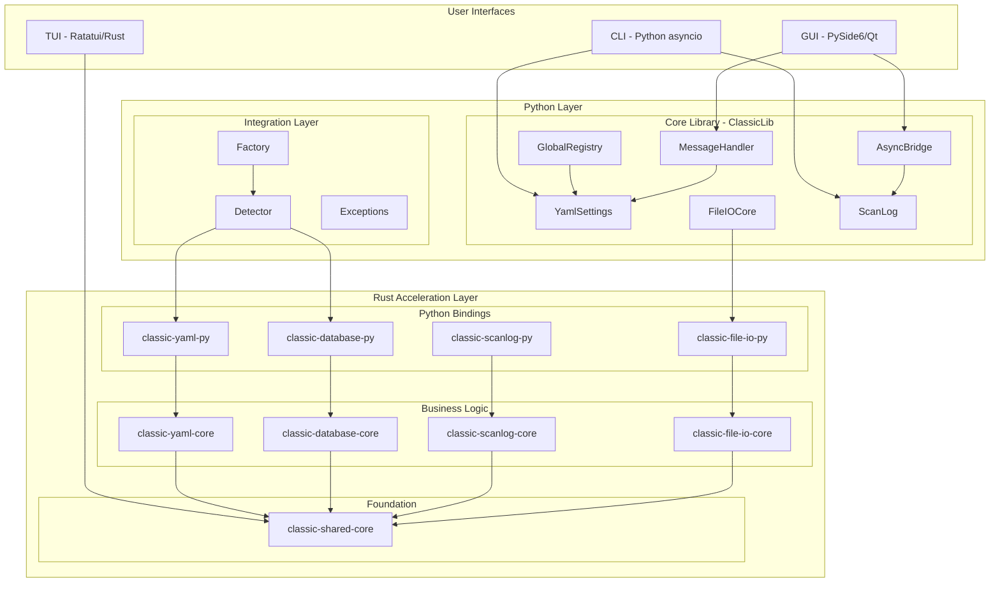

---

## Component Diagrams

### Entry Points

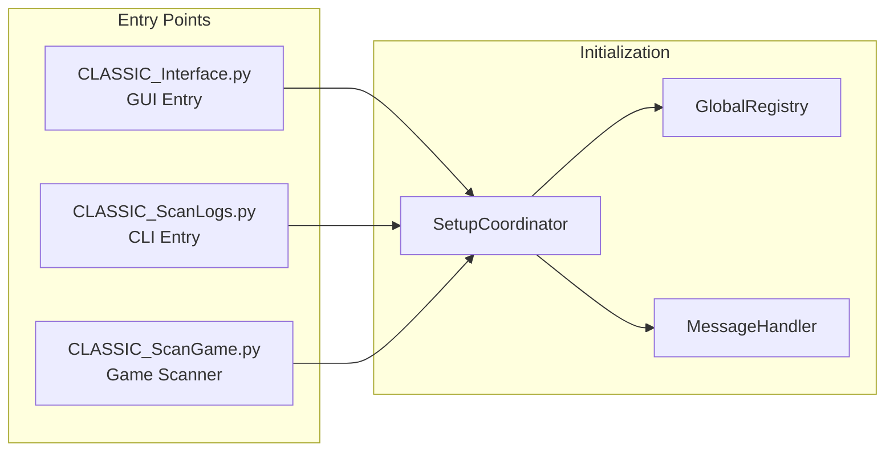

### GUI Architecture (Composition Pattern)

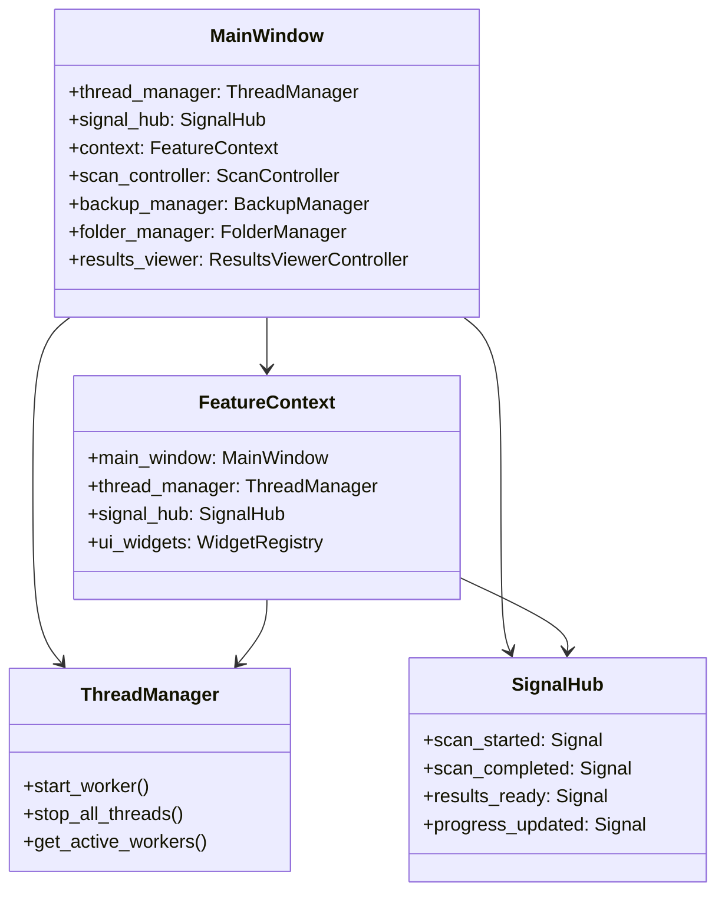

### CLI Architecture (Async-First)

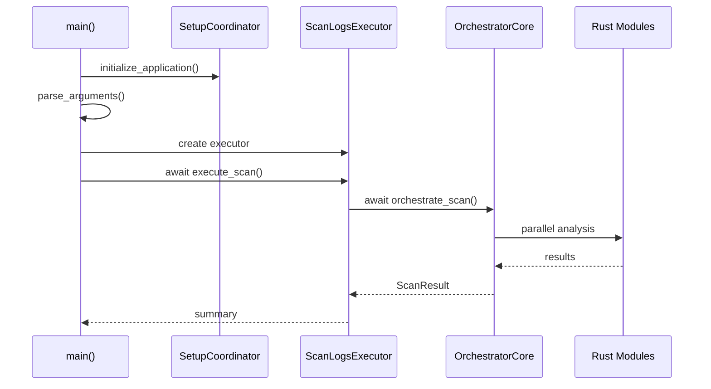

---

## Data Flow

### Crash Log Analysis Flow

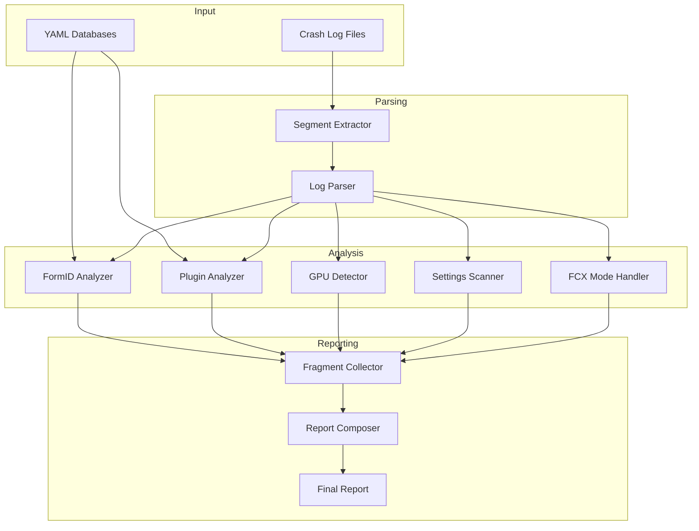

### Configuration Flow

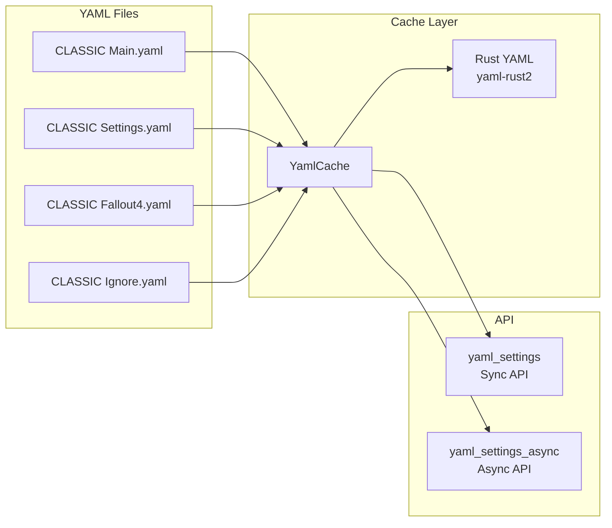

---

## Rust Acceleration Layer

### Three-Tier Architecture

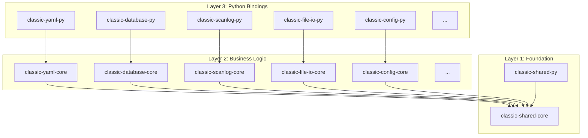

### Crate Organization

| Layer | Purpose | PyO3 | Crate Type |
|-------|---------|------|------------|
| Foundation | Shared runtime, errors, utilities | Minimal | `rlib` |
| Business Logic | Pure Rust algorithms | **None** | `rlib` |
| Python Bindings | PyO3 adapters only | Yes | `cdylib + rlib` |

### Key Architecture Rules

1. **ONE RUNTIME RULE**: All crates share global Tokio runtime via `classic_shared::get_runtime()`
2. **SEPARATION**: Business logic (`-core`) separate from PyO3 bindings (`-py`)
3. **NO MIXED CRATES**: Never combine business logic with PyO3 in same crate
4. **TYPE STUBS**: All `-py` crates must have `.pyi` files

### Performance Gains

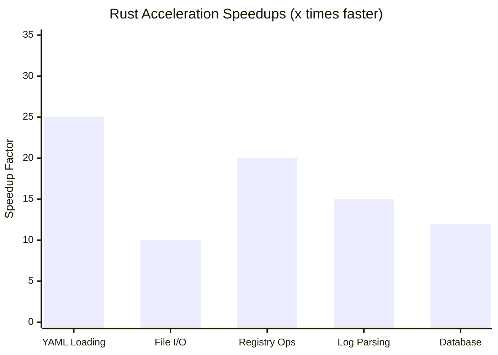

| Component | Python Baseline | Rust Accelerated | Speedup |
|-----------|-----------------|------------------|---------|
| YAML Loading | 100ms | 4ms | 25x |
| File I/O | 50ms | 5ms | 10x |
| Registry Ops | 10ms | 0.5ms | 20x |
| Log Parsing | 200ms | 13ms | 15x |
| Database | 60ms | 5ms | 12x |

---

## Application Interfaces

### GUI (PySide6/Qt)

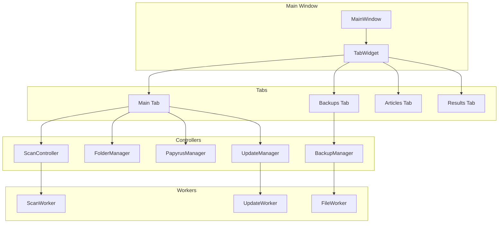

### CLI (Async Python)

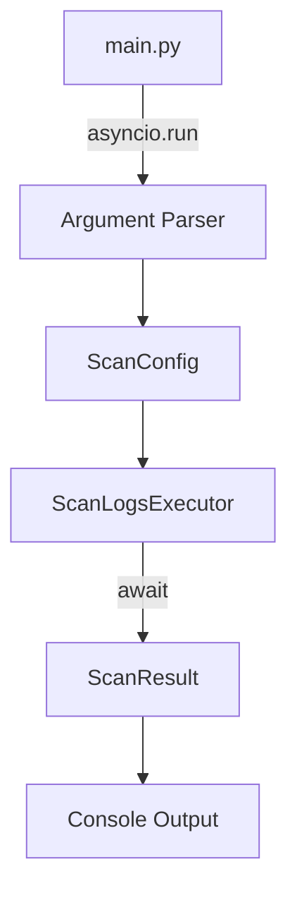

### TUI (Ratatui/Rust)

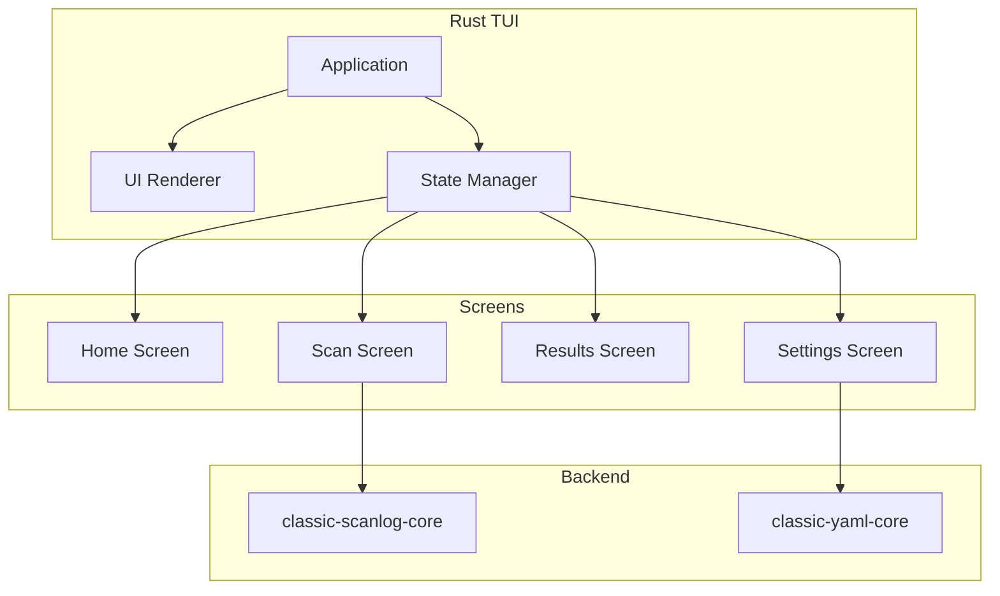

---

## Key Patterns

### AsyncBridge Pattern (GUI Only)

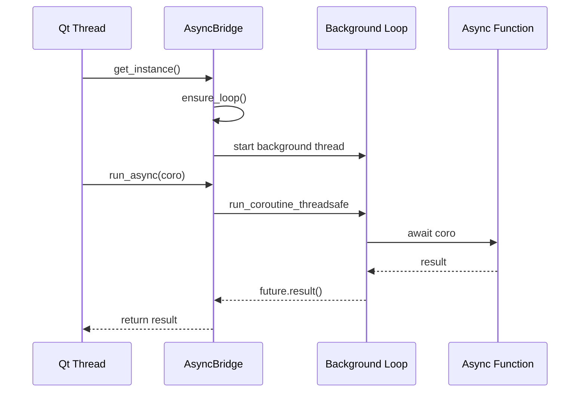

### Async-First Pattern (CLI/TUI)

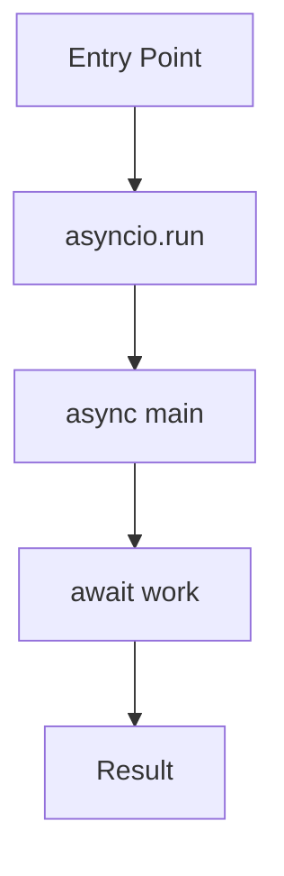

### Factory Pattern (Rust Integration)

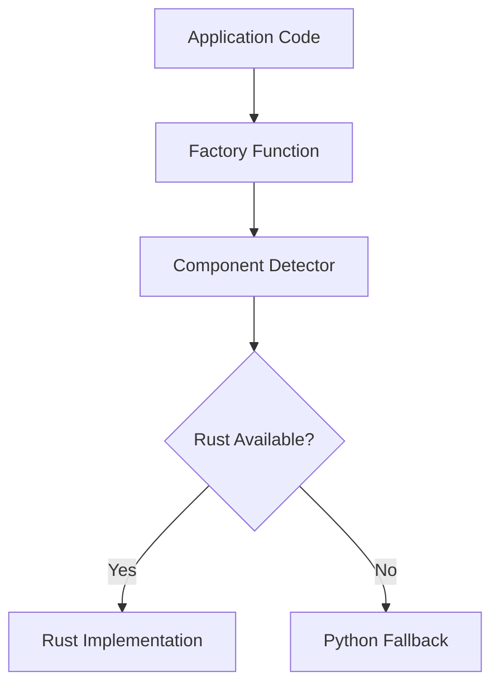

---

## Directory Structure

```
CLASSIC-Fallout4/
├── CLASSIC_Interface.py          # GUI entry point
├── CLASSIC_ScanLogs.py           # CLI entry point
├── CLASSIC_ScanGame.py           # Game scanner entry
│
├── ClassicLib/                   # Main Python library
│   ├── __init__.py              # Public API exports
│   ├── AsyncBridge.py           # Sync/async bridging
│   ├── GlobalRegistry.py        # Global object storage
│   ├── SetupCoordinator.py      # Application initialization
│   │
│   ├── MessageHandler/          # Unified messaging
│   │   ├── handler.py
│   │   ├── formatting/
│   │   ├── output/
│   │   └── progress/
│   │
│   ├── YamlSettings/            # Configuration management
│   │   ├── async_/              # Async API
│   │   ├── sync/                # Sync API
│   │   └── validators.py
│   │
│   ├── FileIO/                  # File operations
│   ├── ScanLog/                 # Crash log analysis
│   │   ├── models/
│   │   ├── fragments/
│   │   ├── pipeline/
│   │   └── composition/
│   │
│   ├── Interface/               # GUI components
│   │   ├── controllers/
│   │   ├── context.py
│   │   └── signal_hub.py
│   │
│   ├── integration/             # Rust integration
│   │   ├── detector.py
│   │   ├── factory/
│   │   └── exceptions.py
│   │
│   ├── Utils/                   # Utility functions
│   ├── python/                  # Python fallbacks
│   └── rust/                    # Rust API wrappers
│
├── ClassicLib-rs/               # Rust workspace
│   ├── Cargo.toml              # Workspace manifest
│   │
│   ├── foundation/             # Layer 1
│   │   ├── classic-shared-core/
│   │   └── classic-shared-py/
│   │
│   ├── business-logic/         # Layer 2 (NO PyO3)
│   │   ├── classic-yaml-core/
│   │   ├── classic-database-core/
│   │   ├── classic-scanlog-core/
│   │   └── ... (19 crates)
│   │
│   ├── python-bindings/        # Layer 3 (PyO3 only)
│   │   ├── classic-yaml-py/
│   │   ├── classic-database-py/
│   │   └── ... (20 crates)
│   │
│   └── ui-applications/        # Standalone apps
│       ├── classic-cli/
│       └── classic-tui/
│
├── tests/                       # Test suite
│   ├── conftest.py
│   ├── fixtures/               # Centralized fixtures
│   └── ... (domain directories)
│
└── docs/                        # Documentation
    ├── api/
    ├── architecture/
    ├── development/
    ├── testing/
    └── rust/
```

---

## See Also

- [API Reference](../api/API_REFERENCE.md)
- [Quick Start Guide](../api/QUICK_START.md)
- [Rust Workspace Architecture](../development/rust_workspace_architecture.md)
- [Async Development Guide](../development/async_development_guide.md)
- [Testing Guide](../testing/TESTING_GUIDE_INDEX.md)

---

*Last updated: December 2025*
