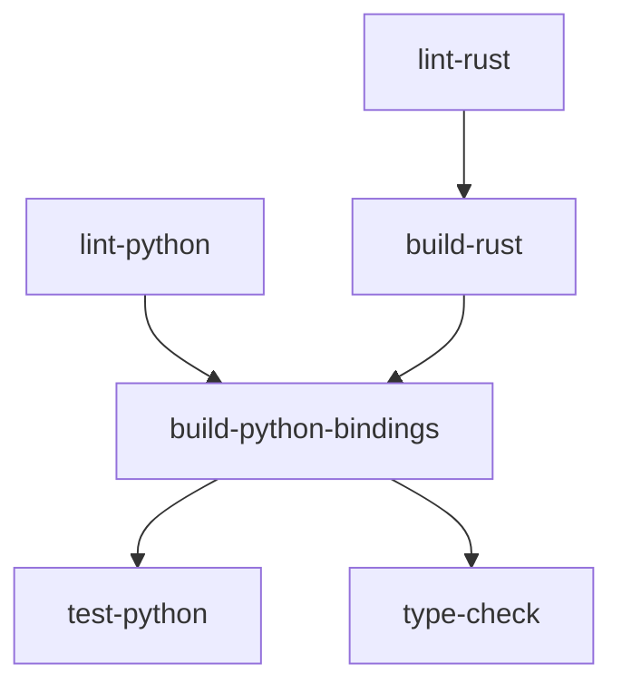

# CI/CD Guide for CLASSIC

This guide explains the Continuous Integration (CI) setup for the CLASSIC project, which handles the hybrid Python-Rust architecture.

## Overview

CLASSIC uses GitHub Actions for automated testing and validation. The CI pipeline runs on every pull request and push to main branches, ensuring code quality and catching issues early.

### CI Workflow Jobs

The main CI workflow (`.github/workflows/ci.yml`) consists of several jobs:

1. **Python Linting** - Fast code quality checks using Ruff
2. **Rust Linting** - Clippy and rustfmt checks for Rust code
3. **Rust Build** - Compile all Rust workspace crates and run tests
4. **Python Bindings Build** - Build PyO3 bindings with maturin
5. **Python Tests** - Run pytest suite (unit, integration, Rust integration)
6. **Type Checking** - Run mypy for Python type validation (optional)

## Trigger Conditions

The CI workflow runs automatically on:
- Pull requests to `main`, `classic-next`, or `dev` branches
- Direct pushes to `main`, `classic-next`, or `dev` branches

## Job Details

### 1. Python Linting (Ruff)
**Timeout**: 10 minutes

Runs fast code quality checks on Python code:
- `ruff check .` - Linting with comprehensive rule set
- `ruff format --check .` - Code formatting validation

**Dependencies**: None (runs first)

### 2. Rust Linting (Clippy)
**Timeout**: 15 minutes

Validates Rust code quality:
- `cargo fmt --check` - Ensures consistent formatting
- `cargo clippy -- -D warnings` - Lint checks treating warnings as errors

**Dependencies**: None (runs first)

**Caching**:
- Cargo registry (`~/.cargo/registry`)
- Cargo index (`~/.cargo/git`)
- Build artifacts (`ClassicLib-rs/target`)

### 3. Build Rust Components
**Timeout**: 20 minutes

Builds all Rust crates in the workspace and runs Rust tests:
- `cargo build --workspace --release` - Full workspace build
- `cargo test --workspace --release` - Run all Rust tests

**Dependencies**: Rust Linting must pass

**Artifacts**: Uploads compiled DLLs and PDBs for use in subsequent jobs (retained for 1 day)

**Caching**: Same as Rust Linting

### 4. Build Python Bindings
**Timeout**: 30 minutes

Uses maturin to build all PyO3 Python binding crates:

Builds the following modules:
- `classic-shared-py`
- `classic-yaml-py`
- `classic-database-py`
- `classic-file-io-py`
- `classic-scanlog-py`
- `classic-config-py`
- `classic-registry-py`
- `classic-perf-py`
- `classic-settings-py`
- `classic-message-py`
- `classic-path-py`

**Dependencies**: Python Linting and Rust Build must pass

**Artifacts**: Uploads Python wheel files (`.whl`) for testing (retained for 1 day)

**Caching**: Cargo registry and build artifacts

### 5. Python Tests
**Timeout**: 30 minutes total (10-15 minutes per test suite)

Runs the pytest test suite with Rust acceleration enabled:

**Test Suites**:
1. **Unit Tests** (timeout: 10 min, per-test: 300s)
   ```bash
   pytest -n 4 -m "unit and not slow" --maxfail=5 --timeout=300 --timeout-method=thread
   ```

2. **Integration Tests** (timeout: 15 min, per-test: 600s)
   ```bash
   pytest -n 4 -m "integration" --maxfail=3 --timeout=600 --timeout-method=thread
   ```

3. **Rust Integration Tests** (timeout: 10 min, per-test: 300s)
   ```bash
   pytest tests/rust_integration/ -v --maxfail=3 --timeout=300 --timeout-method=thread
   ```

**Dependencies**: Python Bindings Build must pass

**Artifacts**: Uploads pytest cache and test results (retained for 7 days)

**Test Timeouts**: Individual tests have timeouts to prevent deadlocks:
- Unit tests: 300 seconds (5 minutes)
- Integration tests: 600 seconds (10 minutes)
- Entire job: 30 minutes maximum

### 6. Type Checking (mypy)
**Timeout**: 15 minutes

Runs mypy type checking on Python code:
```bash
mypy src/ ClassicLib/ --ignore-missing-imports
```

**Dependencies**: Python Bindings Build must pass

**Note**: This job uses `continue-on-error: true` and won't fail the build, as mypy can be noisy.

## Caching Strategy

The CI uses GitHub Actions caching to speed up builds:

### Cargo Caching
Three separate caches for Rust builds:

1. **Registry Cache**
   - Path: `~/.cargo/registry`
   - Key: `{os}-cargo-registry-{Cargo.lock hash}`
   - Stores downloaded crate sources

2. **Index Cache**
   - Path: `~/.cargo/git`
   - Key: `{os}-cargo-index-{Cargo.lock hash}`
   - Stores git dependencies

3. **Build Cache**
   - Path: `ClassicLib-rs/target`
   - Key: `{os}-cargo-build-{Cargo.lock hash}-{source files hash}`
   - Stores compiled artifacts
   - Fallback keys allow partial cache hits

### UV/Python Caching
The `astral-sh/setup-uv@v4` action handles Python dependency caching automatically.

## Debugging CI Failures

### Common Issues and Solutions

#### 1. Test Deadlocks/Timeouts
**Symptom**: Test job times out after 30 minutes or individual tests timeout

**Solutions**:
- Check test logs for the last test that ran before timeout
- Individual test timeouts are set at 300s (unit) or 600s (integration)
- Tests use `pytest-timeout` with `thread` method to force termination
- Look for async/await issues or infinite loops in the failing test

#### 2. Rust Build Failures
**Symptom**: Cargo build or clippy fails

**Solutions**:
- Check clippy warnings - they're treated as errors (`-D warnings`)
- Verify all Rust code has proper documentation (missing docs = error)
- Run locally: `cargo clippy --workspace --all-targets --all-features --manifest-path ClassicLib-rs/Cargo.toml -- -D warnings`
- Check for new Rust 2024 edition issues

#### 3. Python Binding Build Failures
**Symptom**: Maturin build fails for one or more `-py` crates

**Solutions**:
- Check that the crate's `Cargo.toml` has `crate-type = ["cdylib", "rlib"]`
- Verify PyO3 dependencies are correctly specified
- Test locally: `cd ClassicLib-rs/python-bindings/<crate> && maturin build --release`
- Check for missing or outdated `.pyi` stub files

#### 4. Python Test Failures
**Symptom**: Pytest fails with import errors or test failures

**Solutions**:
- Verify Rust acceleration is working (check "Verify Rust acceleration" step output)
- Download the `pytest-results` artifact from the Actions tab for detailed logs
- Run locally with same markers: `uv run pytest -n 4 -m "unit and not slow"`
- Check for singleton pollution between tests (GlobalRegistry, MessageHandler)

#### 5. Ruff Formatting Issues
**Symptom**: `ruff format --check` fails

**Solutions**:
- Run locally: `uv run ruff format .`
- Commit the formatted changes
- Ensure editor is configured to format on save with Ruff

#### 6. Cache Issues
**Symptom**: Build is slow or fails with strange errors

**Solutions**:
- Clear caches manually from the Actions tab → Caches
- Cargo caches are keyed by `Cargo.lock` hash - updating dependencies invalidates cache
- Build cache includes source file hashes for more granular invalidation

## Running CI Checks Locally

Before pushing, run these commands to catch issues early:

```bash
# Python linting
uv run ruff check .
uv run ruff format --check .

# Rust linting
cargo fmt --all --manifest-path ClassicLib-rs/Cargo.toml -- --check
cargo clippy --workspace --all-targets --all-features --manifest-path ClassicLib-rs/Cargo.toml -- -D warnings

# Build Rust components
cargo build --workspace --release --manifest-path ClassicLib-rs/Cargo.toml
cargo test --workspace --release --manifest-path ClassicLib-rs/Cargo.toml

# Build Python bindings (if needed)
./rebuild_rust.ps1  # Windows PowerShell

# Run Python tests
uv run pytest -n 4 -m "unit and not slow" --maxfail=5
uv run pytest -n 4 -m "integration" --maxfail=3
uv run pytest tests/rust_integration/ -v
```

### Node parity checks (required when Rust API surfaces change)

If your PR changes Rust public exports for Node-mapped crates, or changes Node binding exports/signatures, run parity checks before push.

Trigger paths:
- `ClassicLib-rs/business-logic/classic-scanlog-core/src/lib.rs`
- `ClassicLib-rs/business-logic/classic-config-core/src/lib.rs`
- `ClassicLib-rs/business-logic/classic-version-registry-core/src/lib.rs`
- `ClassicLib-rs/node-bindings/classic-node/src/`
- `ClassicLib-rs/node-bindings/classic-node/index.d.ts`

From `ClassicLib-rs/node-bindings/classic-node`:

```bash
bun run parity:gate:local
bun run test:bun
bun run test:node
```

After binding changes, regenerate all three parity baselines and verify all gates pass:
- `python tools/python_api_parity/check_parity_gate.py --repo-root .`
- `python tools/node_api_parity/check_parity_gate.py --repo-root .`
- `python tools/cxx_api_parity/check_parity_gate.py --repo-root .`
See `docs/api/binding-parity-policy.md` for the full new-API workflow.

Release policy: do not cut/tag a release if any parity gate or `index.d.ts` freshness gate is failing.

## Release Process

**Note**: The release process is currently **manual** due to large files that cannot be stored on GitHub.

### Manual Release Steps

1. **Update Version**:
   - Update version in `pyproject.toml`
   - Update version in `Cargo.toml` files as needed
   - Commit: `git commit -am "Bump version to X.Y.Z"`

2. **Create Git Tag**:
   ```bash
   git tag -a vX.Y.Z -m "Release vX.Y.Z"
   git push origin vX.Y.Z
   ```

3. **Build Rust Components**:
   ```bash
   cargo build --workspace --release --manifest-path ClassicLib-rs/Cargo.toml
   ```

4. **Build Python Bindings**:
   ```powershell
   .\rebuild_rust.ps1
   ```

5. **Build PyInstaller Executable**:
   ```bash
   uv run pyinstaller --clean --upx-dir 'C:\Path\to\UPX' .\CLASSIC.spec
   ```

6. **Create Distribution Archive**:
   - Create directory: `CLASSIC-vX.Y.Z-Windows-x64`
   - Copy `dist/CLASSIC/*` to distribution directory
   - Include README, LICENSE, and any required data files
   - Create ZIP archive

7. **Create GitHub Release**:
   - Go to GitHub → Releases → New Release
   - Select the tag created in step 2
   - Upload the distribution ZIP
   - Add release notes describing changes

8. **(Optional) Build Pure Rust Apps**:
   ```bash
   # CLI
   cargo build --release --manifest-path ClassicLib-rs/Cargo.toml -p classic-cli

   # TUI
   cargo build --release --manifest-path ClassicLib-rs/Cargo.toml -p classic-tui
   ```

## CI Workflow Dependencies



## Best Practices

1. **Run checks locally** before pushing to catch issues early
2. **Keep commits focused** - easier to debug CI failures
3. **Monitor job durations** - if builds are getting slower, investigate caching
4. **Review artifacts** - Download test results for detailed failure analysis
5. **Update dependencies carefully** - Rust updates invalidate all caches
6. **Document breaking changes** - Help others understand CI failures

## Troubleshooting Checklist

If CI fails:

- [ ] Check which job failed (look at red X in GitHub Actions)
- [ ] Review the job logs for error messages
- [ ] Download artifacts if available (test results, etc.)
- [ ] Try to reproduce locally with the same commands
- [ ] Check if it's a flaky test (re-run the workflow)
- [ ] Verify dependencies are up to date
- [ ] Check for recent upstream changes that might affect the build
- [ ] Clear caches if seeing strange build errors
- [ ] Ask for help in PR comments with specific error details

## Future Improvements

Potential enhancements to the CI/CD pipeline:

- [ ] Automated release workflow (when large file storage issue is resolved)
- [ ] Code coverage reporting and enforcement
- [ ] Performance regression testing
- [ ] Multi-platform builds (Linux, macOS)
- [ ] Nightly builds for testing latest dependencies
- [ ] Integration with external services (code quality, security scanning)
- [ ] Parallel job execution optimization
- [ ] Build time reduction strategies

## References

- [GitHub Actions Documentation](https://docs.github.com/en/actions)
- [uv Documentation](https://docs.astral.sh/uv/)
- [Maturin Documentation](https://www.maturin.rs/)
- [PyO3 User Guide](https://pyo3.rs/)
- [Cargo Caching Strategies](https://doc.rust-lang.org/cargo/guide/continuous-integration.html)
